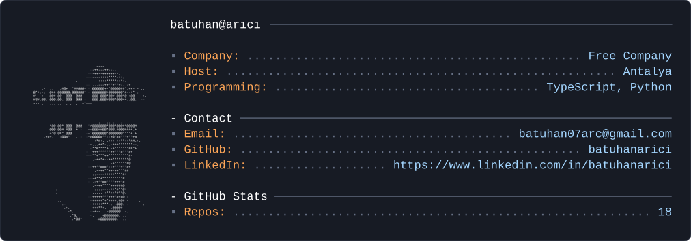

  

# Merhaba, ben Batuhan 👋

🌱 Ziraat Mühendisiyim
💻 Mobil, web ve masaüstü uygulamalar geliştiriyorum
🔬 İlgi alanlarım: tarımda yapay zekâ, biyokontrol, dijital tarım, eğitim ve günlük kullanıma dair pratik araçlar

## 🚀 Projelerim

- **[Bibliotheca](https://github.com/batuhanarici/Bibliotheca)**: Kişisel PDF kütüphanesi için masaüstü uygulaması (Electron, React, SQLite)
- **[Universitely](https://github.com/batuhanarici/Universitely)**: Sınav hazırlığında deneme takibi ve konu bazlı zayıflık analizi (React, Supabase)
- **[Vatsap](https://github.com/batuhanarici/Vatsap)**: Sınav karnelerini velilere WhatsApp'tan gönderen macOS aracı (Electron, React)
- **[awesome-stars](https://github.com/batuhanarici/awesome-stars)**: Yıldızladığım 181 repo, 10 kategoride

## 🛠️ Teknolojiler

TypeScript · React · Electron · Flutter

## 📫 İletişim

[LinkedIn](https://www.linkedin.com/in/batuhanarici)
